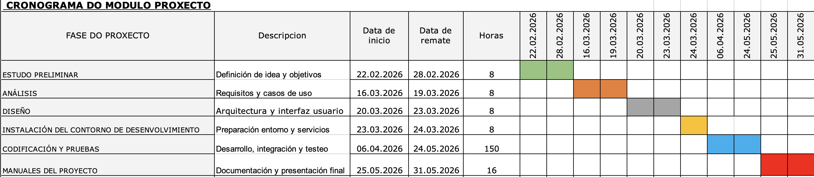
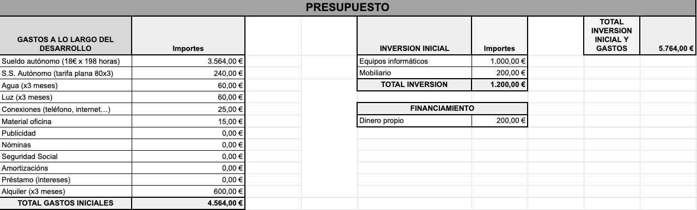

# Orzamento
## Recursos
#### 1. Recursos Humanos:

- **David Otero, como desarrolladora principal**
  - Encargado del diseño, creación y ejecución de la aplicacion
- **Tutor y otros profesores**
  - Orientación en planificacion, desarrollo del proyecto y solución de dudas

#### **2. Recursos Materiales:**

- Hardware: 
  - Ordenador personal
  - Discos duros
  - Software y herramientas:
  - Sistema operativo: MacOS
  - Editores de código: VS Code
  - Contenedores: Docker
  - Base de datos: PostgreSQL
  - Garage
  - Elasticsearch
  - Git y Gitlab
  - Navegador web
  - Zeal
  - Typora
  - Figma
  - Mockflow
- Servicios en la nube:
  - Repositorio remoto en GitLab

## Cronograma

## Presupuesto

